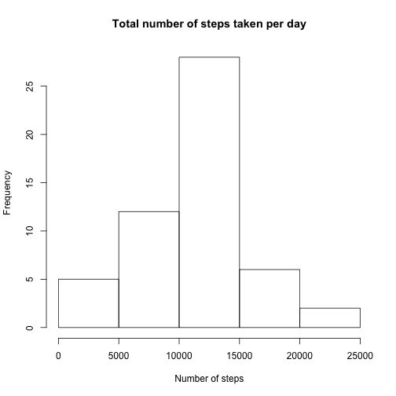
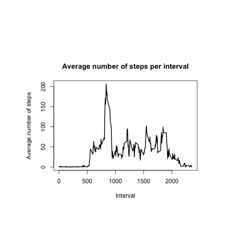
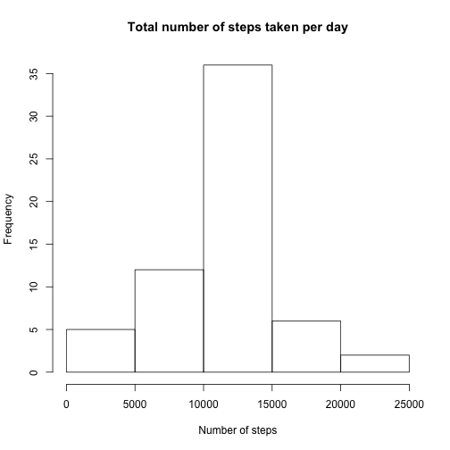
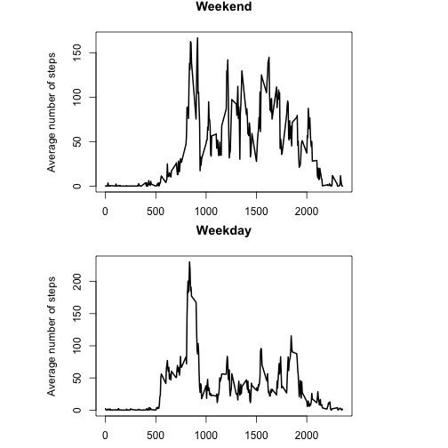

<br>


##1. Loading and preprocessing the data 

```r
download.file( url="https://d396qusza40orc.cloudfront.net/repdata%2Fdata%2Factivity.zip", destfile="activity.zip",method="curl")
dateDownloaded<-date()
unzip("activity.zip")
a<-read.csv("activity.csv")
```

<br>


##2. Mean total number of steps taken per day 

```r
# Aggregate total number of steps per day
b<-aggregate(steps~date,FUN=sum,data=a,na.action=na.omit)
# Make histogram
hist(b$steps,main="Total number of steps taken per day",xlab="Number of steps")
```

 

```r
# Find mean and median number of steps per day
as.integer(mean(b$steps))
```

```
## [1] 10766
```

```r
median(b$steps)
```

```
## [1] 10765
```

```r
#The mean total number of steps taken per day was: `r as.integer(mean(b$steps))`.
#The median total number of steps taken per day was: `r median(b$steps)`.
```

<br>

The mean total number of steps taken per day was: 10766. 

The median total number of steps taken per day was: 10765. 

<br>


##3. What is the average daily activity pattern? 

```r
# Aggregate average number of steps per interval
c<-aggregate(steps~interval,FUN=mean,data=a,na.action=na.omit)
# Plot average number of steps per interval 
par(pin=c(4,2.5))
plot(c$interval, c$steps, type="l", xlab= "Interval", ylab= "Average number of steps",main="Average number of steps per interval", lwd=2)
```

 

```r
# Find inteval with maximum average number of steps
subset(c,c[,2]==max(c$steps))
```

```
##     interval    steps
## 104      835 206.1698
```

```r
# On average across all the days in the dataset, the 5-minute interval `r subset(c,c[,2]==max(c$steps))[1]` contains the maximum number of steps (`r as.integer(subset(c,c[,2]==max(c$steps))[2])` steps).
```

<br>

On average across all the days in the dataset, the 5-minute interval 835 contains the maximum number of steps (206 steps).

<br>


##4. Imputing missing values 


```r
# Find number of records with missing value
length(which(is.na(a$steps)==TRUE))
```

```
## [1] 2304
```

```r
# Create new dataset d with mean number of steps per interval imputed for missings
d<-a
for (i in 1:nrow(d)){
  if(is.na(d[i,1])==T){
    d[i,1]<-subset(c,c$interval==d[i,3])[,2]
  }
}
# Aggregate average number of steps per interval
e<-aggregate(steps~date,FUN=sum,data=d)
# Plot histogram
hist(e$steps,main="Total number of steps taken per day",xlab="Number of steps")
```

 

```r
# Find mean and median number of steps per day
mean(e$steps)
```

```
## [1] 10766.19
```

```r
median(e$steps)
```

```
## [1] 10766.19
```

```r
#The mean total number of steps taken per day in the dataset with imputations was: `r as.integer(mean(e$steps))`.
#The median total number of steps taken per day in the dataset with imputations was: `r as.integer(median(e$steps))`.
```

<br>

The mean total number of steps taken per day in the dataset with imputations was: 10766. 

The median total number of steps taken per day in the dataset with imputations was: 10766. 

There is no major change in the estimates after imputation with the mean.

<br>


##5. Are there differences in activity patterns between weekdays and weekends? 

```r
# Change date from factor into date format
d$date2<-as.Date(d$date, format = "%Y-%m-%d")
# Find day of the week for each date
d$day<-weekdays(d$date2)
# Recode into weekend versus weekday
d$daytype<-ifelse(d$day=="Sunday"|d$day=="Saturday","weekend","weekday")
# Aggregate into average days per interval on weekday versus weekend
f<-aggregate(d$steps,by=list(d$interval,d$daytype),FUN=mean,data=d)
# Panel plot
f1<-subset(f,Group.2=="weekend")
f2<-subset(f,Group.2=="weekday")
par(mfrow=c(2,1),pin=c(4,2.5))
plot(f1$Group.1, f1$x, type="l", xlab= "Interval", ylab= "Average number of steps", lwd=2,main="Weekend")
plot(f2$Group.1, f2$x, type="l", xlab= "Interval", ylab= "Average number of steps", lwd=2,main="Weekday")
```

 


